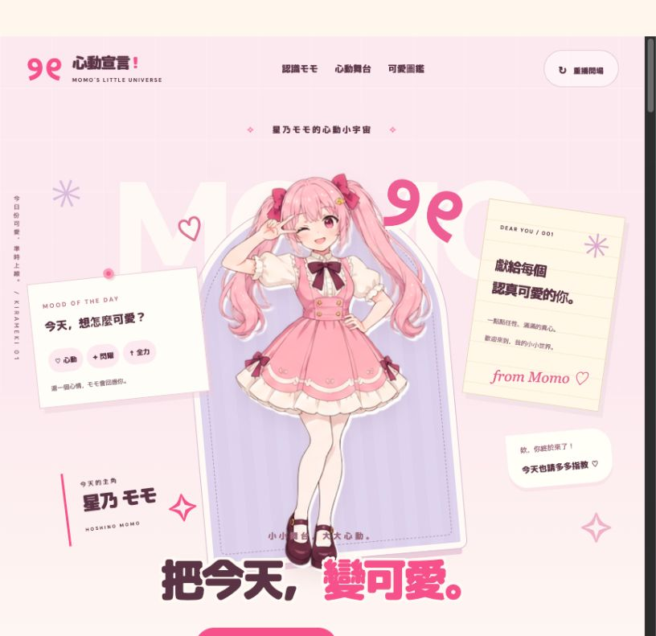
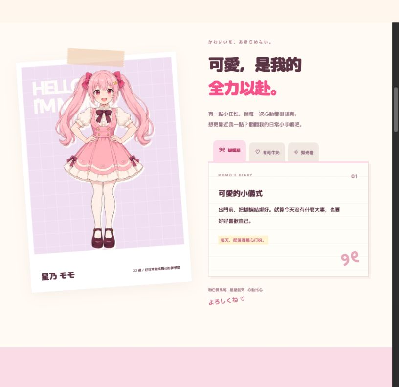
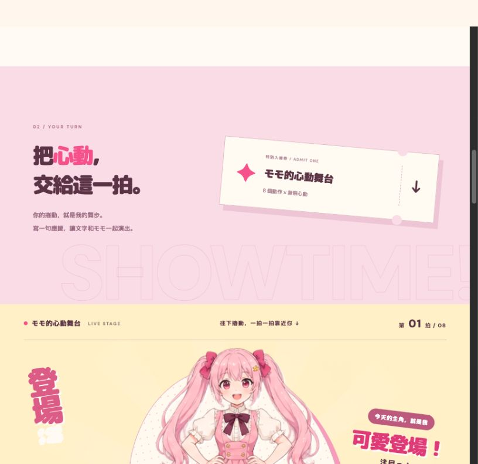
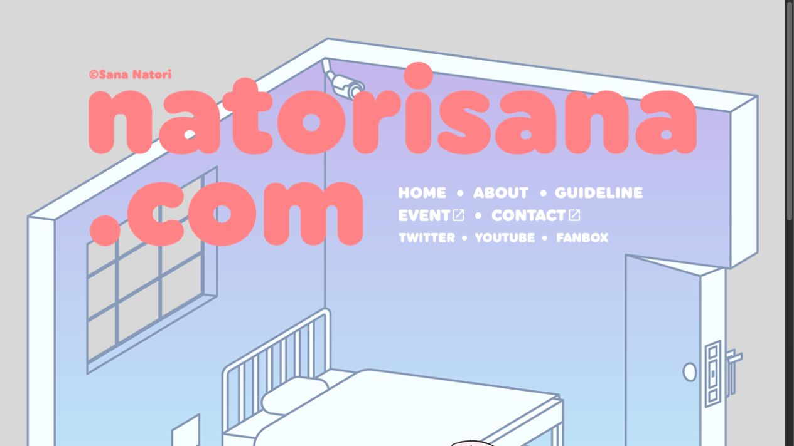

# 星乃モモ：VTuber 官網參考與調整建議

本次查看本機網站首頁、人物介紹及舞台入口，並參考官方網站。僅完成設計檢視，未修改網站程式。

## 1. 首頁：角色視覺鮮明，身分與追蹤入口不足

粉色、立繪與手帳元素有一致性，但「心動宣言」及「把今天，變可愛」的層級高於角色姓名。心情卡、信紙、招呼氣泡與裝飾分散注意力；主要行動導向站內舞台，沒有 YouTube / X 入口。建議以角色姓名及大型立繪為主，搭配一句定位與明確追蹤按鈕，將心情互動縮為彩蛋。

## 2. 人物介紹：個性有呈現，缺少實用資料

目前以喜好手帳、情緒文案為主。可加入活動類型、生日、身高、粉絲名稱、直播與二創標籤、繪師及模型製作資訊；只使用已確認的真實設定，不補造活動紀錄。

## 3. 舞台入口：有特色，但在整體資訊中占比過高

大型舞台入場券、捲動演出及後續動作圖鑑讓網站重心偏向互動展示。建議移至介紹、精選影片與消息之後，作為 SPECIAL 區；縮減重複的邀請文案。

## 官方參考

- [名取さな](https://natorisana.com/)：首頁以個人名稱和插畫建立識別，同時清楚列出 ABOUT、GUIDELINE、EVENT、YouTube、Twitter、FANBOX。適合參考個人世界觀與導覽的結合。
- [hololive 天音かなた介紹頁](https://hololive.hololivepro.com/talents/amane-kanata/)：大型立繪、姓名、自介、YouTube / X、推薦影片，以及生日、身高、粉絲名與標籤資料。適合參考介紹網站的資訊層級。該頁目前標示為畢業生，此處只比較版型。
- [周防パトラ](https://ptrsuou.com/)：瀏覽器遇到安全驗證，因此未將其畫面納入視覺比較。

## 建議順序

角色主視覺與追蹤入口 → 簡介及角色資料 → 精選影片／翻唱 → 最新消息（有實際內容再設置）→ 粉絲資訊 → 互動舞台 → 聯絡方式。

保留粉色雙馬尾、蝴蝶結與手帳氣質，減少同時搶眼的貼紙、標語及旋轉卡片。動態用於角色回應與少量登場效果。

## 檢視範圍

本次為桌面畫面與頁面內容比較，未完成手機、鍵盤、螢幕閱讀器或色彩對比測試。畫面中的小字及淡色註記有可讀性風險，需實測確認；不能据此宣稱無障礙合規。
